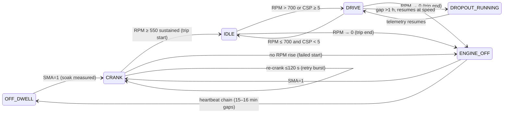

# V3.1 Starter Motor — Design Specification
## Operational-State Reconstruction & Usage-Normalized Feature Hunt (Pre-Registration Document)

| | |
|---|---|
| **Status** | PRE-REGISTERED DESIGN — committed before any candidate result is computed |
| **Created** | 2026-07-02 |
| **Branch** | v11.1-alt |
| **Fleet** | SM only: 34 trucks (14 F + 20 NF), suffix `_SM`. VIN independence rule applies — no cross-dataset VIN analysis. |
| **Predecessors** | V1 → V1.1 (champion frozen) → V2 program → V2.1 → V3 (all 7 candidates REJECT, feature-eng declared closed) |
| **Decision provenance** | User decisions 2026-07-02: (1) no per-VIN region data — Theme 1 stays closed, forward annex only; (2) architecture = State-Engine-First; (3) confirmatory scope = capped gate (7 candidates) + descriptive catalog (~36 features) |

---

## 1. Objective

V3.1 re-opens the closed feature-engineering line under one specific justification: **V3 tested candidates derivable from existing caches, but no operational-state layer exists for the SM fleet.** Without it, usage features carry wrong denominators (calendar days instead of engine-hours), soak time is unmeasured, and telemetry dropout is conflated with ignition-off. V3.1 builds that layer first, then runs a small pre-registered confirmatory gate, and ships a battery-vs-starter attribution channel that is valuable independent of any AUROC movement.

**Honest prior, stated up front:** the data ceiling (nested LOVO AUROC 0.9321, non-nested 0.9357) is evidenced as a data-not-method cap (V3 GBM probe 0.843 < 0.932). The expected outcome of the confirmatory gate is REJECT for most or all candidates. An E2/E3 pass is upside, not the success criterion.

**Tiered success definition:**

| Tier | Deliverable | Success condition |
|---|---|---|
| 1 — Confirmatory | 7 pre-registered candidates through frozen E0→E3 gate | Honest verdict; all-REJECT fully acceptable |
| 2 — Channel | T1 battery-vs-starter attribution triage table | Convergence with V1.1 archetypes reported (SCREEN-GRADE, n=14) |
| 3 — Infrastructure | SM state engine + episode catalog + usage catalog + data-health monitor | SV validation gates pass; promotable to `src/` |
| 4 — Roadmap | Instrumentation annex v2 (500-truck) | Region-mapping / GPS / SPN 171 / SPN 110 asks refined |

Prediction target unchanged: binary failure-risk at the 10-week (~70-day) horizon, one label per truck, LOVO AUROC as the metric. No RUL regression, no unsupervised targets.

---

## 2. Background & Binding Constraints

### 2.1 Frozen baseline and gate (must not re-litigate)

- Champion = **modal-4** feature set, `RidgeClassifier(alpha=1.0)`, fold-internal median imputation → StandardScaler:
  `vsi_withinwk_std_ratio_30d_w`, `rest_vsi_p05_delta90`, `vsi_range_trend`, `dip_depth_last90_delta`
- Frozen numbers: **non-nested LOVO 0.9357** (reconciliation target, E2 baseline), **nested LOVO 0.9321** (headline; CI [0.811, 0.986], permutation p = 0.005).
- Gate parameters inherited verbatim from `STARTER MOTOR/V3/params/V3_gate_params.json`: reconcile tol ±0.002; E1 = MW p ≤ 0.10 ∧ oriented AUROC ≥ 0.60 ∧ L40 fixed-window control ∧ proxy-leak Spearman |ρ| ≤ 0.5 vs {n_weeks, t_start, span} ∧ redundancy Pearson |r| < 0.85 vs modal-4; E2 ADD iff ΔAUROC ≥ +0.01 on 0.9357; E3 nested rerun for E2 survivors only (EXPLORATORY). Seeds: bootstrap 42, permutation 43.
- SMA-dead cohort (event-rate features → null, never pooled): `VIN8_F_SM, VIN9_F_SM, VIN10_NF_SM, VIN11_NF_SM, VIN12_NF_SM, VIN13_NF_SM, VIN20_NF_SM`.
- The 5-second, 6-signal frame is fixed. No sub-crank waveform physics exists at this cadence (a crank is ~1 telemetry row).

### 2.2 Data reality (verified by probes, 2026-07-02)

| Fact | Value | Consequence |
|---|---|---|
| Columns | VIN, CSP, RPM, ANR, GED, VSI, SMA, timestamp (µs, tz-naive); failed file adds SALEDATE, JCOPENDATE, Failure_type | No GPS / odometer / engine-hours / temperature / ignition flag |
| Failure_type | Constant `"Starter Motor"` × 14 | NOT a failure-mode taxonomy; cannot serve as attribution ground truth |
| Cadence | Fixed 5 s (94–97% of diffs); duplicate timestamps common (29k–191k per VIN) | State engine needs an explicit duplicate-row rule |
| VSI | Already in volts (rest median 28.0 V, crank median ~21–22 V); no 0/255 sentinels observed; missing = NaN | Existing cleaning stays verbatim (frozen contract; masking is a harmless no-op). Column dictionary gets a correction note |
| RPM | No 65535 sentinel observed; missing = NaN; RPM=0 rows exist (1.4–8.7%) | Engine-off is partially observable in-band |
| Gap structure | ~17 gaps/day of exactly 15–16 min (99.6% of >15 min gaps); >1 h gaps rare (10–28/VIN), of which 37–54% resume with RPM > 500 | 15-min gaps look like a stationary heartbeat pattern (P0-1); many long gaps are dropout-while-running, NOT ignition-off |
| Crank visibility | 92–100% of SMA episodes have ≥1 valid in-crank VSI sample (~1 sample typical); dip ≈ 6.4 V visible | `min_vsi_crank` computable; dip *shape* is not |
| Failed-start signal | Episodes with no RPM > 500 within 30 s: VIN1_F 10.4%, VIN2_F 19.0% vs VIN1_NF 0.3%, VIN2_NF 8.8% | Confirms the family behind A1; unconditioned variants already in graveyard |
| Silent-gap VINs | VIN1_F 72 d, VIN4_F 97 d, VIN5_F 32 d, VIN8_F 37 d, VIN9_F 142 d between last telemetry and JCOPENDATE | Motivates C1 (missingness probe) and T3 (data-health monitor) |
| Volumes | Failed 30,925,573 rows / NF 76,250,496 rows | Polars lazy, per-VIN streaming, `py -3` |

### 2.3 Leakage-trap registry (inherited; all guards active)

1. **n_weeks ceiling 0.952** — observation length encodes the label. Guard: L40 fixed-window control, proxy audit.
2. **t_start ceiling 0.893** — failed trucks entered telemetry later. Guard: proxy audit; calendar-anchored features flagged.
3. **Extraction-date wall** — 16/20 NF end at 2026-02-09/16. End-anchored calendar features encode the label.
4. **`vsi_dominant_freq` = 1/n_weeks** — BANNED; spectral family closed.
5. **Config confound** — SMA event rates differ ~10× by telematics config; never pool across SMA-dead cohort.
6. **Cumulative-totals trap** — any lifetime count is ∝ observation length. All catalog features are **rates or fixed-window deltas**; lifetime totals are banned-by-construction (see §6.3).

---

## 3. Scope

### 3.1 Brief-idea disposition map

Every idea from the V3.1 brainstorming brief, mapped to its disposition. Graveyard citations are binding — **nothing listed as tested/rejected is re-run in its rejected form.**

**Theme 1 — Ambient temperature at engine start**

| Brief idea | Disposition |
|---|---|
| Weather APIs / ERA5 / NOAA / Open-Meteo / lat-long interpolation | **DATA-BLOCKED** — no GPS/region channel (`V3/appendix/temperature_infeasibility.md`). Forward annex only (§9) |
| Month-of-year seasonality | **GRAVEYARD** — V1.1 E4: KW p = 0.90 (drive VSI) / 0.95 (rest VSI) |
| Day-night estimation (hour-of-day) | **GRAVEYARD** — V3 F4b `night_start_fraction_delta90`: AUROC 0.500, MW p = 0.90 |
| Cold Start Indicator / soak-conditioned dips | **GRAVEYARD-ADJACENT** — V2.1 B4 `z_cold_dip_delta90` redundant (r ≈ 0.92–0.94 vs champion dip); V3 F1b `cold_start_fraction_delta90` null (p = 1.0) |
| Seasonal start behaviour (within-VIN winter-vs-summer contrast) | **GATED as C2** — the one untested temperature-adjacent construction (§7.2) |
| Thermal Stress / Fatigue indices, temp-normalized cranking load | **DATA-BLOCKED** — require actual temperature; annex |

**Theme 2 — Number of engine restarts**

| Brief idea | Disposition |
|---|---|
| Inferring cranks from speed/time-gap heuristics | **UNNECESSARY for counting** — SMA is a direct crank signal; 20,729-event catalog exists (`cache/events/`). Gap heuristics are repurposed for OFF-dwell/soak (P0-1, §5) and SMA-undercount cross-validation (P0-5) |
| Stop-duration thresholds (15/30/45/60/90 min/overnight) | **RESOLVED EMPIRICALLY** — P0-1 heartbeat verdict + soak distribution (§5.3) replace assumed thresholds |
| Daily/weekly/monthly crank counts, cranks per trip/day | **CATALOG** (rates only) |
| Lifetime Estimated Starts, cumulative totals | **BANNED** — observation-length leak (§6.3) |
| Cranking Density / Intensity, Starts per Engine Hour | **GATED as B1** `starts_per_engine_hour_delta90` |
| Starts per Kilometer | **CATALOG** — expected r > 0.9 with B1; B1 is the registered representative |
| Crank Frequency Trend / duty-cycle | **GRAVEYARD** — `sma_duty_last90` 0.645/0.611; V2 duty-cycle WEAK |
| Abnormal Restart Frequency / retry bursts | **GRAVEYARD** (`retry_burst_rate_last90` AUROC 0.589) — voltage-conditioned variant is **GATED as A1** |
| Fleet-normalized crank rate | **CATALOG** with fold-safety note (normalization constants train-fold-only) |

**Theme 3 — Battery voltage influence**

| Brief idea | Disposition |
|---|---|
| Voltage Drop During Cranking | **CHAMPION** — `dip_depth_last90_delta` is a frozen modal-4 feature |
| Voltage Stability Score / Battery Weakness Trend / Voltage Degradation Rate | **CHAMPION** — `vsi_withinwk_std_ratio_30d_w`, `rest_vsi_p05_delta90`, `vsi_range_trend` |
| Average / Minimum Start Voltage | **CATALOG** (`baseline_vsi` statistics) |
| Low Voltage Starts / Low Voltage Exposure Index | **GATED as A3** `lowv_crank_share_delta90` |
| Battery Recovery Behaviour | **GRAVEYARD** — post-crank recovery slope AUROC 0.552, p = 0.678 (V2 P2); recovery *time* quantized ≥5 s (V3 F4c not-run) |
| Consecutive Low Voltage Events, Voltage Stress Index | **CATALOG** (Experimental) |
| Battery-vs-starter attribution (leading-indicator question) | **NEW — GATED A1/A2 + CHANNEL T1** — the genuinely novel Theme-3 contribution |

**Theme 4 — Operational state reconstruction**

| Brief idea | Disposition |
|---|---|
| Ignition OFF / ON / Cranking / Running / Idle / Parking / Overnight / Trip start / Trip end | **BUILT in §5** — no SM state machine exists (the graph's `ignition_state_analysis.py` is ALT-only); ALT 6-state design is the reference, re-parameterized for SM |
| Loading / Unloading / Refuelling / Depot / Traffic / Maintenance / Driver rest | **NOT SEPARABLE** — requires GPS/context data; documented out of scope |
| HMM / Bayesian inference / sequence modelling | **REJECTED with rationale** — at 5 s cadence with 3 informative discrete signals and n=34 for any validation, latent-state models are unauditable and untunable without circularity. Rule-based with per-episode confidence flags is chosen; probabilistic classification is used exactly where ambiguity is real (gap taxonomy: OFF vs DROPOUT vs UNKNOWN) |
| Temporal clustering / behavioural segmentation | **CATALOG** — duty-cycle descriptors (trips/day, short-trip share, idle share) serve as the segmentation basis; no unsupervised clustering enters the gate (unsupervised methods 80–100% FP at this n — ALT lesson) |

### 3.2 Out of scope

- Alternator fleet (separate program). Battery as a *component model* (only battery-as-covariate for SM attribution).
- Any modification to `cache/weekly/`, `cache/events/`, `src/`, or frozen champion artifacts.
- RUL regression (window matrix from V2 remains the RUL deliverable). New pager development beyond T1/T2/T3.
- Re-running anything in the V3 §2.1 settled list or the graveyard above.

---

## 4. Phase 0 — Data-Reality Probes (pre-registration inputs)

Probes tune definitions; they never accept/reject candidates (no multiplicity cost). Outputs land in `state/out/P0_*.json` + a data-reality memo. **Label access: forbidden** (probes run on signals + timestamps only, all 34 VINs treated identically).

| ID | Probe | Method | Output feeding |
|---|---|---|---|
| P0-1 | **Heartbeat hypothesis** — are chains of 15–16-min gaps ignition-OFF dwell? | Fleet-wide gap-length histogram; boundary-row forensics (RPM/CSP before chain start: shutdown signature; SMA/RPM-rise within 120 s after chain end); fraction of crank events at chain ends | `OFF_DWELL` semantics; soak measurability. Pre-registered decision rule: heartbeat CONFIRMED iff ≥70% of sampled chains end in a crank-or-RPM-rise within 120 s AND ≥70% begin ≤120 s after RPM falls to 0/null. Only the gap band ([14, 18] min) and chain-min-length (≥1 gap) may be tuned; nothing else |
| P0-2 | **Duplicate timestamps** | Quantify per VIN; adopt rule: stable sort, keep all rows, dt=0 treated as same-instant (matches crank extractor); state of a duplicated instant = highest-priority state among its rows | State-engine determinism |
| P0-3 | **Dropout taxonomy** for >1 h gaps, all 34 VINs | Resume-with-RPM>500 in first 5 rows ⇒ `DROPOUT_RUNNING`; resume with SMA=1 ≤ 300 s ⇒ `OFF_CONFIRMED`; else `UNKNOWN_GAP` | C1 candidate; T3 monitor; per-VIN dropout burden table |
| P0-4 | **Timezone codification** | tz-naive = vehicle-local (IST single-zone, India ops); carried from V3 F4b | C2 seasonal windows; catalog time-of-day splits |
| P0-5 | **SMA observability audit** | Count engine-run episode starts with no SMA=1 within preceding 120 s → per-VIN undercount factor | Extends config-confound documentation; catalog covariate #33 |
| P0-6 | **Constants memo** | Confirm sentinel reality (VSI in volts, no 0/255; no RPM 65535), event-catalog `success` definition (`rpm_max_15s ≥ 550`), baseline_vsi window ([−90 s, −10 s], ≥3 valid readings) | Spec-to-code contract; column-dictionary correction note |

---

## 5. Phase 1 — SM Operational-State Engine

Module `V3.1/state/sm_state_engine.py`; parameters pre-registered in `params/V3_1_state_params.json`. Consumes raw parquets read-only; writes episodes + daily rollups to `V3.1/state/out/`. **Never touches frozen caches.**

### 5.1 Row-level classifier (priority-ordered, first match wins)

| Priority | State | Condition | Rationale |
|---|---|---|---|
| 1 | `CRANK` | SMA == 1 | Direct signal. `cwr_flag` if previous row ≤10 s earlier has RPM > 400 (B5 definition reused verbatim, not re-adjudicated) |
| 2 | `ENGINE_OFF` | RPM == 0 or RPM null | Confirmed observable in-band (1.4–8.7% of rows) |
| 3 | `IDLE` | 0 < RPM ≤ 700 and CSP < 5 | 700 = existing `RPM_DRIVE_THRESH` (frozen contract alignment); idle ≈ 600 rpm confirmed empirically |
| 4 | `DRIVE` | RPM > 700 or CSP ≥ 5 | Movement or charging-speed regime |
| 5 | `UNKNOWN` | otherwise | Sentinel/conflict rows |

CSP sentinel (≥ 65535) → null before classification; null CSP treated as CSP < 5 for IDLE/DRIVE split with `low_conf` flag.

### 5.2 Episode layer and gap semantics

- Same-state rows with inter-row gap ≤ 60 s merge into one episode.
- Gap ∈ [14, 18] min in a chain (P0-1 band): if heartbeat CONFIRMED → `OFF_DWELL` episode spanning the chain; if REFUTED → `UNKNOWN_GAP`. **Chain** = a run of ≥ 1 such gaps where any intervening observed segments last ≤ 60 s (heartbeat pattern: single wake-up rows separated by ~15-min silences).
- Gap > 1 h → P0-3 taxonomy: `DROPOUT_RUNNING` / `OFF_CONFIRMED` / `UNKNOWN_GAP`.
- Every episode carries: state, t_start, t_end, duration, n_rows, confidence ∈ {high, medium, low}, evidence tags.

### 5.3 Derived objects

- **Trip**: first sustained run (RPM ≥ 550 for ≥ 2 consecutive rows) after a CRANK/OFF boundary → until next OFF/OFF_DWELL start. Attributes: duration; distance = Σ CSP·dt/3600 over dt ≤ 10 s only (gap-capped trapezoid); idle share; max/mean speed; n_cranks.
- **Soak**: duration of OFF/OFF_DWELL immediately preceding each crank (null if preceding episode is DROPOUT/UNKNOWN).
- **Engine-hours**: Σ dt over IDLE ∪ DRIVE rows, dt capped at 10 s (gap-robust).
- **Observed-hours / dropout-hours**: per week, for C1 and T3.

### 5.4 State transition diagram



(`DRIVING_LIGHT/CRUISE/HEAVY` sub-states from the ALT reference are **not** adopted — no consumer needs them; YAGNI.)

### 5.5 Validation gates (infrastructure-grade, label-blind)

| Gate | Criterion | On fail |
|---|---|---|
| SV-1 | ≥ 90% of crank events preceded within 120 s by OFF/OFF_DWELL/UNKNOWN_GAP, or flagged re-crank/CWR | Investigate segmentation; B-family candidates at risk |
| SV-2 | Per-VIN state-dwell distribution report (no impossible dwell patterns) | Report-only |
| SV-3 | km/day ∈ [10, 800] and engine-hrs/day ∈ [0.5, 22] for ≥ 90% of VIN-weeks | B1 dropped if fail (drop-not-replace) |
| SV-4 | Soak measurable for ≥ 60% of cranks (if P0-1 confirms); soak distribution bimodal report | Soak catalog features → Experimental |
| SV-5 | Champion untouched: E0 reconciliation re-run = 0.9357 ± 0.002 | Halt (should be impossible by construction) |

### 5.6 Promotion path

State engine stays in `V3.1/state/` for this iteration. Promotion to `STARTER MOTOR/src/` happens only after SV gates pass and the verdict is written — as a separate, explicit commit.

---

## 6. Phase 2 — Usage & Exposure Catalog (descriptive)

~36 features computed for all 34 VINs, documented in `reports/V3_1_SM_feature_catalog.md` with **definition, formula, required columns, assumptions, confidence class, limitations, validation route, production feasibility**. Weekly/L40/Δ90 conventions inherited (Δ90 = last-90-d mean − per-VIN L40-baseline mean; masked week = active_days ≥ 2).

### 6.1 Catalog table

| # | Feature | Family | Definition sketch | Confidence | Disposition |
|---|---|---|---|---|---|
| 1 | `engine_hours_per_day` | Exposure | Σ IDLE∪DRIVE dt / observed days | High | Catalog |
| 2 | `km_per_day` | Exposure | gap-capped Σ CSP·dt / observed days | High | Catalog |
| 3 | `trips_per_day` | Exposure | trip count / observed days | Medium | Catalog |
| 4 | `mean_trip_duration_min` | Exposure | mean trip duration | Medium | Catalog |
| 5 | `mean_trip_km` | Exposure | mean trip distance | Medium | Catalog |
| 6 | `short_trip_share` | Exposure | share of trips < 15 min | Medium | Catalog |
| 7 | `idle_share` | Exposure | IDLE dt / (IDLE+DRIVE) dt | High | Catalog |
| 8 | `stop_density` | Exposure | stops per drive-hour | Medium | Catalog |
| 9 | `overnight_off_share` | Exposure | share of OFF_DWELL > 8 h | Medium (heartbeat-dep.) | Catalog |
| 10 | `weekly_engine_hours_trend` | Exposure | TS-slope of weekly engine-hours, 12 wk | Experimental (usage-decline ≈ reverse causation; leak-adjacent) | Catalog |
| 11 | `soak_before_crank_median` | Crank context | weekly median soak | Medium | Catalog |
| 12 | `soak_before_crank_p90` | Crank context | weekly p90 soak | Medium | Catalog |
| 13 | `overnight_start_share` | Crank context | share of cranks with soak ≥ 8 h | Medium | Catalog |
| 14 | `hot_restart_share` | Crank context | share of cranks with soak < 30 min | Medium | Catalog |
| 15 | `starts_per_active_day` | Crank context | valid cranks / active days | High | Catalog (existing factor) |
| 16 | `starts_per_100km` | Crank context | valid cranks / (km/100) | Medium | Catalog — B1 twin (r > 0.9 expected) |
| 17 | `crank_success_ratio` | Crank context | share with rpm_max_15s ≥ 550 | High | Catalog — graveyard-adjacent (`first_crank_fail_rate` 0.706 admissible-never-selected) |
| 18 | `recrank_within_120s_rate` | Crank context | retry-burst rate | High | **Graveyard** (`retry_burst_rate_last90` 0.589) — listed for completeness, NOT recomputed |
| 19 | `crank_dur_p95` | Crank context | p95 event duration (5 s quantized) | Low | Catalog — graveyard-adjacent (`extended_crank_tail` 0.612) |
| 20 | `cranks_per_trip` | Crank context | valid cranks / trips | Medium | Catalog |
| 21 | `consecutive_high_crank_days_max90` | Crank context | max run of days > p75 own crank rate, last 90 d | Experimental | Catalog |
| 22 | `weekly_crank_rate` | Crank context | valid cranks / week (rate form only) | High | Catalog; **lifetime totals BANNED** |
| 23 | `pre_crank_vsi_median` | Attribution | weekly median `baseline_vsi` | High | Catalog |
| 24 | `hard_start_goodv_rate` | Attribution | failed cranks with baseline_vsi ≥ 27.0 V, per active day | High | **→ GATED A1** (Δ90 form) |
| 25 | `lowv_crank_share` | Attribution | share of cranks with baseline_vsi < 26.0 V | High | **→ GATED A3** (Δ90 form) |
| 26 | `dip_resid_weekly_median` | Attribution | weekly median of dip-depth residual (see A2) | Medium | **→ GATED A2** (trend form) |
| 27 | `lowv_consecutive_events_max` | Attribution | longest run of consecutive low-voltage cranks | Experimental | Catalog |
| 28 | `voltage_stress_index` | Attribution | z-sum composite (lowv share, dip level, rest floor) | Experimental (composite; components better alone) | Catalog |
| 29 | `post_trip_recovery_delta` | Attribution | rest VSI 0–30 min post-trip minus pre-trip | Low (alternator-adjacent; recovery slope WEAK 0.552) | Catalog |
| 30 | `rest_vsi_overnight_p05` | Attribution | rest-VSI p05 restricted to soak ≥ 8 h | Medium — **predicted redundant** (r > 0.85 vs champion `rest_vsi_p05_delta90`; cold-dip precedent r ≈ 0.93) | Catalog |
| 31 | `dropout_hours_per_week` | Data quality | Σ DROPOUT hours / week | High | Catalog covariate; **→ GATED C1** (share Δ90 form) |
| 32 | `heartbeat_coverage_share` | Data quality | OFF_DWELL-attributable share of non-observed time | Medium | Catalog |
| 33 | `sma_undercount_factor` | Data quality | inferred starts / observed SMA starts (P0-5) | Medium | Catalog covariate |
| 34 | `vsi_valid_share` | Data quality | share of rows with valid VSI | High | Catalog covariate |
| 35 | `dip_seasonal_contrast` | Seasonal | see C2 | Experimental | **→ GATED C2** |
| 36 | `monsoon_start_share` | Seasonal | share of cranks in Jun–Sep | Experimental (duty proxy, not temperature) | Catalog |

### 6.2 Confidence classification scheme

- **High** — direct signal derivation, robust to gaps, physically unambiguous, production-computable from the 6-signal feed.
- **Medium** — depends on state-engine reconstruction (heartbeat/gap semantics) or moderate assumptions; degrades gracefully to null.
- **Experimental** — composite, weakly identified, leak-adjacent, or physics story indirect. Never promoted without a future pre-registration.

### 6.3 Catalog discipline (binding rules)

1. **No within-iteration promotion.** Label-separation statistics (per-feature AUROC/MW) for catalog features are computed only *after* the Phase-3 gate verdict is written, are labeled EXPLORATORY, and cannot add candidates to V3.1's gate. Promising catalog features become pre-registered candidates for a future V3.2.
2. **Banned-by-construction registry.** Lifetime cumulative counts ("Lifetime Estimated Starts", total cranks, total km) encode observation length (n_weeks ceiling 0.952) and are documented as banned with reasoning — not silently omitted.
3. **Fleet normalization** (any "fleet-normalized rate") must compute normalization constants on training folds only; the catalog documents this as a production constraint.
4. **SMA-dead cohort**: all crank-event-rate features null for the 7 cohort VINs.

---

## 7. Phase 3 — Confirmatory Gate

### 7.1 Protocol (inherited verbatim)

- **E0 Reconciliation**: reproduce modal-4 non-nested LOVO = 0.9357, |Δ| ≤ 0.002, via `V3/features/_gate_core.py` machinery (copied, not modified). Halt on fail.
- **E1 Admissibility** (each candidate): MW p ≤ 0.10 ∧ oriented AUROC ≥ 0.60 ∧ L40 fixed-window control (no history-length artifact) ∧ proxy-leak Spearman |ρ| ≤ 0.5 vs {n_weeks, t_start, span} ∧ redundancy Pearson |r| < 0.85 vs each modal-4 feature.
- **E2 Increment**: modal-4 + candidate, fixed-subset LOVO; ADD iff ΔAUROC ≥ +0.01 over 0.9357.
- **E3 Nested rerun**: E2 survivors only; EXPLORATORY label; only an E3-surviving increment is a "genuine win".
- **Multiplicity**: BH-FDR across all 7 MW p-values (single family, mirroring V3's 7).
- Seeds 42/43; fold-internal imputation/scaling; SCREEN-GRADE labeling on all results (n = 34).

### 7.2 Pre-registered candidates (frozen at spec commit)

Notation: Δ90 = mean(last 90 d weekly values) − mean(per-VIN L40-baseline weekly values); weekly = masked ISO weeks (active_days ≥ 2); all windows causal (end-anchored at evaluation time, no post-t_end data); valid crank = non-artifact event (`dur_s ≤ 60`); failed crank = valid crank with `success == False` (rpm_max_15s < 550, per existing event catalog); `dip_depth_last90_level` = mean dip_depth over valid events in the last 90 d (level, not delta — the V3 dose factor, reused).

**Family A — Attribution (battery-vs-starter separation). Inputs: existing crank-event catalog only.**

- **A1 `hard_start_goodv_rate_delta90`** — weekly rate = (failed cranks with `baseline_vsi` ≥ 27.0 V) / active days; feature = Δ90.
  *Physics*: a starter that fails to achieve run-up despite a healthy 24 V bus (rest median 28.0 V) isolates starter-side degradation — brush contact loss, solenoid contact erosion, pinion engagement failure — from battery weakness. This is the voltage-conditioned repair of two graveyard features (`first_crank_fail_rate` 0.706 admissible-never-selected; `failed_crank_rate_last30` E2 +0.004): the conditioning removes battery-driven false positives that diluted them.
  *Risks*: failed-start sparsity on NF trucks (n_nonnull ≈ 27); redundancy check vs `dip_depth_last90_delta`.
- **A2 `dip_resid_trend_12w`** — per VIN: OLS fit `dip_depth ~ β0 + β1·baseline_vsi` on non-artifact events in the L40 baseline window *excluding the last 12 masked weeks* (≥ 30 qualifying events required, else null); weekly median residual over the last 12 masked weeks; feature = Theil–Sen slope of those 12 weekly medians.
  *Physics*: dip depth rising *at constant supply voltage* means rising current draw or contact resistance in the crank circuit — a starter-side signature by construction. Residualization is the designed decorrelator from the champion dip feature.
  *Risks*: residual trend may still correlate with `dip_depth_last90_delta` (r-gate decides); regression stability at low event counts.
- **A3 `lowv_crank_share_delta90`** — weekly share = (cranks with `baseline_vsi` < 26.0 V) / (cranks with valid `baseline_vsi`); feature = Δ90.
  *Physics*: low-voltage cranking dose — each low-voltage crank draws higher current for longer (P = VI at fixed work), accelerating brush/commutator and solenoid-contact wear. Battery-side stress exposure, complementary to A1.
  *Risks*: overlap with champion `rest_vsi_p05_delta90` (r-gate); threshold sensitivity (±0.5 V reported descriptively, single registered threshold 26.0 V).

**Family B — Usage-normalized intensity. Inputs: crank catalog + state engine.**

- **B1 `starts_per_engine_hour_delta90`** — weekly rate = valid cranks / engine-hours (null if engine-hours < 5 h in week); feature = Δ90. Null for SMA-dead cohort.
  *Physics*: start-cycle dose per operating hour is the correct wear-rate normalization for a cycle-limited component (~30–40k crank design life). Calendar-day denominators (graveyard `starts_per_active_day`) conflate observation density with duty.
  *Risks*: config confound (cohort nulls); SV-3 must pass; duty-cycle features have a null history (cold_start_fraction p = 1.0).
- **B2 `dose_dip_x_intensity`** — fold-internal z(dip_depth_last90_level) × z(starts_per_engine_hour_last90).
  *Physics*: energy-per-crank × cycle rate = power dissipation dose. Re-registration of V3's rejected `dose_dip_x_starts` with a materially changed denominator (engine-hours, not active days) — allowed under the novel-or-materially-changed rule, with the V3 rejection (MW p = 0.2515) disclosed as the prior.
  *Risks*: modest prior given the V3 result; interaction interpretability.

**Family C — Probes (expected-null honesty probes, labeled as such).**

- **C1 `dropout_share_delta90`** — weekly share = DROPOUT hours / (DROPOUT + observed hours); feature = Δ90.
  *Physics*: missingness-as-signal — degrading electrical systems can kill the TCU before the starter fails outright (V12-ALT precedent: GED-absence; SM precedent: 5/14 failed VINs go silent 32–142 d before JCOPENDATE).
  *Risks*: highest leak-adjacency in the set — dropout patterns relate to observation structure; the strict proxy audit (|ρ| ≤ 0.5) is expected to be decisive either way. That is the point of the probe.
- **C2 `dip_seasonal_contrast`** — median dip_depth over non-artifact events in Dec–Feb minus median over Apr–Jun, within the VIN's L40-masked span (pooling across calendar years if the span covers more than one); null unless ≥ 15 qualifying events in *each* window. No Δ90 (it is already a within-VIN contrast).
  *Physics*: an aging battery/starter amplifies cold-morning dips; the within-VIN contrast dodges the no-GPS problem (each VIN is its own climate control).
  *Risks*: season coverage correlates with span/t_start (proxy gate likely trips); high null rate. Included to close the last temperature-adjacent idea *with evidence* rather than assumption.

### 7.3 Drop-not-replace rule (V3 precedent: F1a dropped, F4c not-run)

If Phase 0/1 invalidates an input — heartbeat refuted (soak semantics), SV-3 fail (engine-hours) — the affected candidate is **dropped, never swapped** for a post-hoc alternative. BH-FDR then runs over the surviving set.

### 7.4 What would constitute a win

E2 pass → E3 nested rerun → if the nested increment survives, V3.2 refit protocol discussion opens (champion remains frozen throughout V3.1 regardless). All-REJECT → the verdict documents seven more closed doors with exact numbers, and Tier 2–4 deliverables stand.

---

## 8. Phase 4 — Channels (not E-gated; SCREEN-GRADE evaluation)

- **T1 Battery-vs-Starter Attribution Table** (flagship). Per-VIN evidence vector: A2-cascade fire state (existing channel), `hard_start_goodv_rate` level, `lowv_crank_share` level, rest-VSI trend direction. Deterministic rubric maps evidence → `BATTERY_FIRST / STARTER_FIRST / MIXED / INSUFFICIENT` + per-VIN evidence column. Starting rubric (exact thresholds frozen in `params/V3_1_candidates.json` at Task 0): STARTER_FIRST if hard-start-at-good-voltage events present in ≥ 2 of the last 12 masked weeks AND lowv_crank_share ≤ fleet median; BATTERY_FIRST if A2-cascade fired OR (lowv_crank_share > fleet p75 AND rest-VSI trend declining); MIXED if both sides trigger; INSUFFICIENT if VSI-dead/SMA-dead or < 10 valid cranks in the last 90 d.
  *Validation*: convergence with V1.1 archetype assignments (A1 solenoid / A2 battery-cascade / A3 / A4-silent). Disclosed limitation: archetypes are themselves telemetry-derived, so this is a **consistency check, not ground-truth accuracy** (`Failure_type` is constant and useless for this). Report: agreement count among the 14 F, NF distribution, per-VIN evidence. No ship-claim beyond "triage table, SCREEN-GRADE".
  *Business value*: routes a cheap battery service vs a starter inspection — actionable regardless of AUROC; extends the shipped A2→battery-first routing (A6) to the whole fleet.
- **T2 Graded-window refinement**: A5 policy table extended with the attribution dimension — battery-first bands inherit the A2 28–91 d window; starter-first bands inherit the persistence∧RED 126–284 d window; MIXED defaults to the earlier window. Pure table logic on existing evidence; no new claims about window widths.
- **T3 Data-health monitor**: per-VIN weekly dropout/heartbeat coverage tracker with an escalation flag for accelerating dropout (would have flagged the 5 silent-gap VINs). Production-facing; evaluated descriptively.
- Any *pager* claim (none planned) faces the V2.1 accept-bar: recall ≥ 10/14 ∧ NF eps/truck-yr < 0.19 ∧ median lead ≥ 116 d.

---

## 9. Theme-1 Closure & Instrumentation Annex

`appendix/temperature_closure_and_annex.md` consolidates: the V3 infeasibility finding (no geo-anchor); the tested-null proxies (month seasonality KW p = 0.90/0.95; night-start AUROC 0.500; cold-dip redundancy r ≈ 0.93); C2 as the final within-VIN construction with its gate result; and the forward path for the 500-truck fleet — **per-VIN operating-region mapping (cheapest ask)** → regional climatology (IMD normals / Open-Meteo, no per-truck GPS needed); GPS + weather archive; **SPN 171 Ambient Air Temperature / SPN 110 Engine Coolant Temperature** CAN channels (coolant-at-key-on is the best thermal proxy for crank stress). Also records the user decision (2026-07-02) that no region data is available for the 34-truck fleet.

---

## 10. Deliverables & Layout

### 10.1 Brief-deliverable mapping (14 items)

| Brief item | V3.1 artifact |
|---|---|
| 1 Feature engineering document | `reports/V3_1_SM_feature_catalog.md` |
| 2 Mathematical definitions | §7.2 (gated, frozen here) + catalog formula column + execution-time `V3_1_SM_feature_dictionary.md` |
| 3 Assumptions & limitations | Catalog per-feature fields + §2.2 data-reality memo |
| 4 Scientific justification | §7.2 physics blocks + catalog rationale column |
| 5 Automotive domain rationale | §7.2 + T1 rubric documentation |
| 6 Validation methodology | §7.1 (gate) + §5.5 (SV gates) + §8 (channel evaluation) |
| 7 Feature dependency graph | Mermaid DAG in catalog (signals → states → episodes → features → gate/channels) |
| 8 Data flow diagrams | §11 |
| 9 State transition diagrams | §5.4 |
| 10 Implementation roadmap | `Plan/V3_1_SM_implementation_plan.md` (separate document, task-level) |
| 11 Visualization plan | §10.3 |
| 12 Risk assessment | §12 |
| 13 Production feasibility | Catalog production-notes column + §9 annex + compute notes (§12) |
| 14 Priority ranking | §13 |

### 10.2 Directory tree

```
STARTER MOTOR/V3.1/
  Plan/        V3_1_SM_spec.md · V3_1_SM_implementation_plan.md
  params/      V3_1_gate_params.json · V3_1_state_params.json · V3_1_candidates.json   ← committed BEFORE any result
  state/       sm_state_engine.py · P0_probes/ · tests/ · out/ (episode + daily-rollup parquets, P0 JSONs)
  features/    _factors.py · build_candidate_caches.py · V3_1_feature_gate.py · tests/ · out/ (<candidate>_cache.csv, V3_1_gate_summary.json)
  analysis/    V3_1_validation.py (BH-FDR, MI, correlation matrix) · out/
  heuristics/  T1_attribution.py · T2_windows.py · T3_data_health.py · out/
  reports/     V3_1_SM_feature_catalog.md · V3_1_SM_state_engine_report.md · V3_1_SM_results.md · V3_1_SM_verdict.md · V3_1_SM_exec_summary.md · V3_1_SM_feature_dictionary.md
  graphs/      G1–G8 (below)
  appendix/    temperature_closure_and_annex.md · instrumentation_v2.md
```

### 10.3 Visualization plan (4-layer professional style; no trend connectors)

| ID | Graph |
|---|---|
| G1 | Per-VIN state-timeline strips (sample failed + NF; full set in out/) |
| G2 | Fleet soak-duration distribution (log-x; bimodality annotation) |
| G3 | Gap-length histogram with 15–16-min heartbeat band highlighted (P0-1 evidence) |
| G4 | Attribution quadrant: battery-evidence vs starter-evidence axes, 34 VINs, archetype-colored |
| G5 | Gate panels per candidate: F/NF distributions + AUROC + E1/E2 verdict stamp |
| G6 | km/day vs engine-hrs/day plausibility scatter (SV-3 evidence) |
| G7 | Dropout-share timelines for the 5 silent-gap VINs (C1/T3 evidence) |
| G8 | Feature dependency DAG (rendered from catalog Mermaid) |

---

## 11. Data Flow

```mermaid
flowchart LR
    RAW[Raw SM parquets<br/>107M rows, 6 signals + ts] --> P0[Phase 0 probes<br/>P0-1..P0-6]
    RAW --> SE[State engine<br/>row states → episodes]
    P0 -->|params| SE
    SE --> EP[Episode catalog<br/>trips · soak · engine-hrs · dropout]
    EVT[Frozen crank-event catalog<br/>cache/events (READ-ONLY)] --> FA[Family A factors]
    EP --> FB[Family B/C1 factors]
    CAL[Calendar] --> FC[C2 factor]
    FA & FB & FC --> GATE[E0→E1→E2→E3 gate<br/>_gate_core inherited]
    EP --> CAT[Usage catalog ~36 features]
    FA --> T1[T1 attribution table]
    A2ch[Existing A2 cascade channel] --> T1
    T1 --> T2[T2 graded windows]
    EP --> T3[T3 data-health monitor]
    GATE & CAT & T1 & T2 & T3 --> REP[Reports · verdict · graphs]
    WK[Frozen weekly cache<br/>cache/weekly (READ-ONLY)] -.E0 reconciliation.-> GATE
```

---

## 12. Risks & Most-Likely Outcome

| Risk | Likelihood | Mitigation |
|---|---|---|
| Heartbeat hypothesis refuted | Medium | Soak features degrade to UNKNOWN-tolerant nulls; B1 unaffected (needs only RUN detection); pre-registered decision rule prevents motivated reasoning |
| State mis-segmentation at 5 s cadence | Medium | Confidence flags; SV-1..SV-4 gates; episode-level (not row-level) feature consumption |
| All 7 candidates REJECT | **High — this is the stated prior** | Tiered success (§1); Tier 2–4 ship regardless |
| C1 proxy-leak trip | High | That outcome is itself the documented answer to missingness-as-signal |
| Attribution circularity (archetypes are telemetry-derived) | Certain (disclosed) | Framed as convergence check; SCREEN-GRADE; no accuracy claim |
| Multiplicity at n = 34 | Structural | Capped 7 tests, single BH-FDR family, drop-not-replace |
| Compute (107M rows through state engine) | Low | Polars lazy, per-VIN streaming, `py -3`; budget ~45 min full-fleet pass; episode outputs are small |
| Scope creep from the 50+-idea brief | Medium | §3.1 disposition map is binding; catalog discipline §6.3 |

**Most-likely outcome**: ceiling holds; A1/A2 are the best hopes for a SOFT-SIGNAL or E2 pass; the state engine, usage catalog, T1 attribution table, T3 monitor, and instrumentation annex are the durable deliverables.

---

## 13. Priority Ranking (impact × feasibility)

| Rank | Item | Expected impact | Rationale |
|---|---|---|---|
| 1 | State engine + episode catalog (§5) | Foundation | Every Theme-2/4 idea and all future SM work consumes it; permanent asset |
| 2 | T1 attribution channel (§8) | High business value | New actionable deliverable (service routing) independent of AUROC |
| 3 | A1 `hard_start_goodv_rate_delta90` | Best gate hope | Novel conditioning on a confirmed raw discriminator |
| 4 | A2 `dip_resid_trend_12w` | Gate hope | Designed decorrelation from champion; starter-specific by construction |
| 5 | B1 `starts_per_engine_hour_delta90` | Medium | Correct physics denominator; duty-cycle null history tempers prior |
| 6 | C1 `dropout_share_delta90` | Medium-low (high info value) | Novel missingness probe; leak audit is decisive either way |
| 7 | A3 / B2 | Supporting | Complete the attribution/dose families |
| 8 | C2 `dip_seasonal_contrast` | Low | Closes Theme 1 with evidence |
| 9 | Catalog breadth (~36) + T2/T3 | Documentation & ops value | Confidence-classified reference for V3.2 and the 500-truck program |

---

## 14. Definition of Done

1. `params/` JSONs committed **before** any candidate result exists (pre-registration gate).
2. P0-1..P0-6 executed; data-reality memo written; state params frozen.
3. State engine built with tests; SV-1..SV-5 adjudicated; episode + daily rollups for all 34 VINs.
4. E0 reconciliation passes (0.9357 ± 0.002); all surviving candidates through E1→E2(→E3); BH-FDR reported.
5. Catalog (~36 features) computed and classified; discipline rules §6.3 honored (no within-iteration promotion).
6. T1 attribution table + convergence report; T2 extended window table; T3 monitor output.
7. All §10 deliverables written; graphs G1–G8 rendered; one honest verdict explicitly permitting all-REJECT.
8. Column-dictionary correction note filed (VSI volts / sentinel reality).

---

## Appendix A — Canonical Paths & Constants

| Item | Value |
|---|---|
| Failed parquet | `Data/processed/starter_motor_complete/2026-03-06-12-38-23-starter_motor_failed.parquet` (30,925,573 rows) |
| NF parquet | `Data/processed/starter_motor_complete/2026-03-06-12-39-14-starter_motor_non_failed.parquet` (76,250,496 rows) |
| Crank-event catalog (READ-ONLY) | `STARTER MOTOR/cache/events/V1_SM_crank_events.parquet` (~20k events; gap-naive sanity reference 20,729 ± 15%) |
| Weekly cache (READ-ONLY) | `STARTER MOTOR/cache/weekly/V1_SM_weekly_<vin>.parquet` |
| Feature matrix | `STARTER MOTOR/V1.1/results/V1_1_SM_feature_matrix.csv` |
| Gate core (copy, don't modify) | `STARTER MOTOR/V3/features/_gate_core.py` |
| Gate params source | `STARTER MOTOR/V3/params/V3_gate_params.json` |
| Config constants | `STARTER MOTOR/src/V1_SM_config.py` — `CRANK_MAX_INTRA_GAP_S=10`, `CRANK_SAMPLE_WIDTH_S=5.0`, `CRANK_MAX_PLAUSIBLE_DUR_S=60`, `RPM_DRIVE_THRESH=700`, `CRANK_SUCCESS_RPM=550` |
| baseline_vsi | mean VSI in [ts_start − 90 s, ts_start − 10 s], ≥ 3 valid readings |
| Modal-4 | `vsi_withinwk_std_ratio_30d_w`, `rest_vsi_p05_delta90`, `vsi_range_trend`, `dip_depth_last90_delta` |
| SMA-dead | `VIN8_F_SM, VIN9_F_SM, VIN10_NF_SM, VIN11_NF_SM, VIN12_NF_SM, VIN13_NF_SM, VIN20_NF_SM` |
| Interpreter | `py -3` (NOT `.venv`) |
| New voltage thresholds (registered) | good-voltage 27.0 V; low-voltage 26.0 V; sensitivity ±0.5 V descriptive-only |
| New state thresholds (registered) | episode merge gap ≤ 60 s; heartbeat band [14, 18] min (P0-1 tunable); dropout ≥ 1 h; trip run-up RPM ≥ 550 × 2 rows; engine-hour dt cap 10 s; B1 weekly minimum 5 engine-hours |
