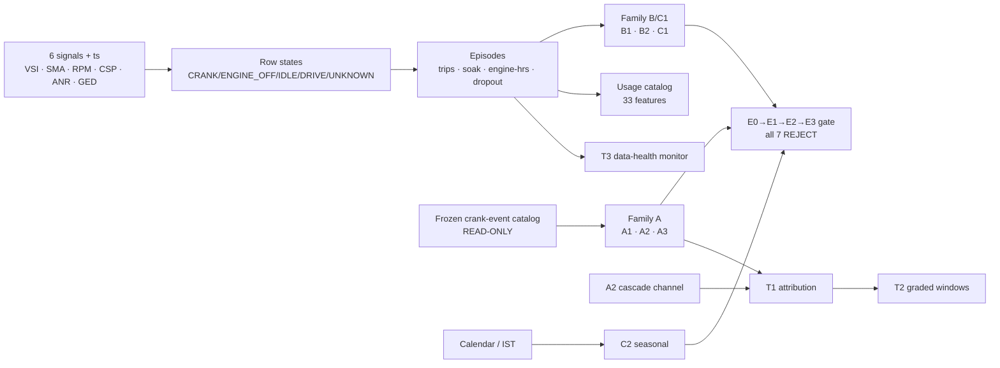

# V3.1 Starter Motor — Usage & Exposure Feature Catalog

A descriptive, confidence-classified reference for the SM fleet. **33 features are computed
for all 34 VINs** (`features/out/V3_1_SM_catalog.csv`); the remaining spec §6.1 rows are
documented-not-computed with reasons, per catalog discipline (§6.3 — nothing is silently
omitted). Fleet medians below are computed directly from the catalog CSV. **This is a
descriptive catalog: none of these statistics added a candidate to the V3.1 gate** (§6.3 rule
1 — no within-iteration promotion). Label-separation statistics for these features are
reported post-gate as EXPLORATORY (§ Exploratory leads, below) and are V3.2 pre-registration
candidates only.

---

## 1. Catalog table (spec §6.1 with realized fleet medians)

Confidence classes per spec §6.2 (High / Medium / Experimental). **The soak / heartbeat
family is Experimental** because P0-1 refuted the heartbeat hypothesis: soak is measurable
for only 0.7102 of cranks and its distribution is biased short (see data-reality memo P0-1).

| # | Feature | Family | Fleet median | Confidence | Disposition |
|---|---|---|---|---|---|
| 1 | `engine_hours_per_day` | Exposure | 7.634 | High | Catalog |
| 2 | `km_per_day` | Exposure | 208.063 | High | Catalog |
| 3 | `trips_per_day` | Exposure | 24.382 | Medium | Catalog |
| 4 | `mean_trip_duration_min` | Exposure | 19.221 | Medium | Catalog |
| 5 | `mean_trip_km` | Exposure | 8.435 | Medium | Catalog |
| 6 | `short_trip_share` | Exposure | 0.663 | Medium | Catalog |
| 7 | `idle_share` | Exposure | 0.181 | High | Catalog |
| 8 | `stop_density` | Exposure | 3.118 | Medium | Catalog |
| 9 | `overnight_off_share` | Exposure | 0.000 | **Experimental** (heartbeat-dep.) | Catalog |
| 10 | `weekly_engine_hours_trend` | Exposure | −1.117 | Experimental (leak-adjacent) | Catalog |
| 11 | `soak_before_crank_median` | Crank context | 0.010 | **Experimental** (soak) | Catalog |
| 12 | `soak_before_crank_p90` | Crank context | 0.159 | **Experimental** (soak) | Catalog |
| 13 | `overnight_start_share` | Crank context | 0.000 | **Experimental** (soak) | Catalog |
| 14 | `hot_restart_share` | Crank context | 0.703 | **Experimental** (soak) | Catalog |
| 15 | `starts_per_active_day` | Crank context | 0.831 | High | Catalog (existing factor) |
| 16 | `starts_per_100km` | Crank context | 0.388 | Medium | Catalog — B1 twin |
| 17 | `crank_success_ratio` | Crank context | 0.930 | High | Catalog — graveyard-adjacent |
| 18 | `recrank_within_120s_rate` | Crank context | — | High | **Graveyard — NOT recomputed** (`retry_burst_rate_last90` 0.589) |
| 19 | `crank_dur_p95` | Crank context | 5.000 | Low | Catalog (5 s quantized) |
| 20 | `cranks_per_trip` | Crank context | 0.037 | Medium | Catalog |
| 21 | `consecutive_high_crank_days_max90` | Crank context | 2.000 | Experimental | Catalog |
| 22 | `weekly_crank_rate` | Crank context | 5.548 | High | Catalog — **lifetime totals BANNED** |
| 23 | `pre_crank_vsi_median` | Attribution | 26.724 | High | Catalog |
| 24 | `hard_start_goodv_rate` | Attribution | 0.000 | High | Catalog → **GATED A1** (Δ90) |
| 25 | `lowv_crank_share` | Attribution | 0.495 | High | Catalog → **GATED A3** (Δ90) |
| 26 | `dip_resid_last90_median` | Attribution | 0.261 (n=32) | Medium | Catalog → **GATED A2** (trend) |
| 27 | `lowv_consecutive_events_max` | Attribution | 10.000 | Experimental | Catalog |
| 28 | `voltage_stress_index` | Attribution | 0.089 (n=33) | Experimental (composite) | Catalog |
| 29 | `post_trip_recovery_delta` | Attribution | — | Low (alternator-adjacent) | **Documented-not-computed** (recovery slope WEAK 0.552) |
| 30 | `rest_vsi_overnight_p05` | Attribution | — | Medium | **Documented-not-computed** (predicted redundant r > 0.85 vs champion) |
| 31 | `dropout_hours_per_week` | Data quality | 8.039 | High | Catalog → **GATED C1** (share Δ90) |
| 32 | `heartbeat_coverage_share` | Data quality | 0.000 | Medium (heartbeat refuted → 0) | Catalog |
| 33 | `sma_undercount_factor` | Data quality | 0.90–0.99* | Experimental (detector-limited) | In `P0_sma_observability.json` (P0-5) |
| 34 | `vsi_valid_share` | Data quality | 0.779 | High | Catalog covariate |
| 35 | `dip_seasonal_contrast` | Seasonal | — | Experimental | **GATED C2** (gate artifact, not catalog matrix) |
| 36 | `monsoon_start_share` | Seasonal | 0.383 | Experimental (duty proxy) | Catalog |

\*`sma_undercount_factor` is reported per-VIN in `P0_sma_observability.json` (range
0.9042–0.9906) rather than in the catalog matrix, and is DETECTOR-LIMITED — not a literal
undercount (see data-reality memo P0-5).

**Two supporting descriptors** also appear in the catalog matrix as gate/channel inputs and
are computed for all 34 VINs: `dip_depth_last90_level` (fleet median 5.019, n = 33 — the V3
dose factor reused as B2's z-input) and `rest_vsi_trend_12w` (median 0.000 — the T1 rest-VSI
trend evidence axis). Counting these, the matrix holds 33 columns.

---

## 2. Banned-by-construction registry (§6.3 rule 2)

Documented, not silently omitted:

| Banned quantity | Reason |
|---|---|
| Lifetime Estimated Starts, total cranks | ∝ observation length → n_weeks leakage ceiling 0.952 |
| Total km, cumulative engine-hours | Same observation-length leak |
| `vsi_dominant_freq` (= 1/n_weeks) | Inherited BAN; spectral family closed (leakage-trap registry §2.3) |

All catalog crank/exposure features are **rates or fixed-window Δ90 deltas** by construction.
`weekly_crank_rate` (#22) is the rate form; its cumulative counterpart is banned.

## 3. Documented-not-computed

- **#18 `recrank_within_120s_rate`** — the retry-burst family is graveyard
  (`retry_burst_rate_last90` AUROC 0.589); listed for completeness, not recomputed.
- **#29 `post_trip_recovery_delta`** — alternator-adjacent; post-crank recovery slope already
  WEAK (0.552, V2 P2) and recovery *time* is ≥ 5 s quantized. Not computed.
- **#30 `rest_vsi_overnight_p05`** — predicted redundant (r > 0.85 vs champion
  `rest_vsi_p05_delta90`; cold-dip precedent r ≈ 0.93). Not computed.

## 4. SMA-dead cohort (§6.3 rule 4)

All crank-event-rate features are null for the 7 SMA-dead VINs: `VIN8_F_SM, VIN9_F_SM,
VIN10_NF_SM, VIN11_NF_SM, VIN12_NF_SM, VIN13_NF_SM, VIN20_NF_SM`. C1 `dropout_share_delta90`
is the one SMA-dead-exempt candidate (it needs only observed-vs-dropout hours), which is why
it computes for all 34 VINs.

---

## 5. Feature dependency DAG (spec §10.1 item 7 / §11; rendered as G8)

Signals → states → episodes → features → gate/channels. Rendered image:
`graphs/G8_dependency_dag.png`.

---

## 6. Exploratory post-gate label-separation (EXPLORATORY — V3.2 leads only)

Computed **after** the gate verdict was written, on the descriptive catalog, labeled
EXPLORATORY per §6.3 rule 1. **These are raw single-feature statistics on 33 catalog features
and are BH-unsafe**: the smallest raw p (0.0219) adjusts to ~0.72 over 33 simultaneous tests.
Nothing here is significant after multiplicity control. They are **V3.2 pre-registration
leads, not V3.1 findings.** Full table from `analysis/out/catalog_exploratory_stats.csv`:

| Feature | n_nonnull | raw MW p | oriented AUROC |
|---|---|---|---|
| `monsoon_start_share` | 34 | 0.0219 | 0.7357 |
| `hard_start_goodv_rate` (LEVEL) | 34 | 0.0239 | 0.6875 |
| `consecutive_high_crank_days_max90` | 34 | 0.0404 | 0.6946 |
| `dropout_hours_per_week` | 34 | 0.0715 | 0.6857 |
| `vsi_valid_share` | 34 | 0.1037 | 0.6679 |
| `dip_resid_last90_median` | 32 | 0.1239 | 0.6464 |
| `weekly_engine_hours_trend` | 34 | 0.1779 | 0.6393 |
| `lowv_crank_share` | 34 | 0.1779 | 0.6393 |
| `soak_before_crank_median` | 34 | 0.2075 | 0.6304 |
| `pre_crank_vsi_median` | 34 | 0.2341 | 0.6232 |
| `voltage_stress_index` | 33 | 0.2512 | 0.6214 |
| `mean_trip_duration_min` | 34 | 0.2858 | 0.6107 |
| `stop_density` | 34 | 0.2858 | 0.6107 |
| `starts_per_100km` | 34 | 0.3913 | 0.5893 |
| `starts_per_active_day` | 34 | 0.4109 | 0.5857 |
| `crank_dur_p95` | 34 | 0.4311 | 0.5661 |
| `mean_trip_km` | 34 | 0.4311 | 0.5821 |
| `overnight_start_share` | 34 | 0.4372 | 0.5250 |
| `overnight_off_share` | 34 | 0.4372 | 0.5250 |
| `engine_hours_per_day` | 34 | 0.4518 | 0.5786 |
| `weekly_crank_rate` | 34 | 0.4732 | 0.5750 |
| `soak_before_crank_p90` | 34 | 0.4732 | 0.5750 |
| `short_trip_share` | 34 | 0.4732 | 0.5750 |
| `cranks_per_trip` | 34 | 0.5403 | 0.5643 |
| `idle_share` | 34 | 0.5637 | 0.5607 |
| `dip_depth_last90_level` | 33 | 0.5723 | 0.5607 |
| `trips_per_day` | 34 | 0.6366 | 0.5500 |
| `crank_success_ratio` | 34 | 0.6874 | 0.5429 |
| `lowv_consecutive_events_max` | 34 | 0.7783 | 0.5304 |
| `hot_restart_share` | 34 | 0.8474 | 0.5214 |
| `km_per_day` | 34 | 0.9025 | 0.5143 |
| `rest_vsi_trend_12w` | 34 | 0.9264 | 0.5107 |
| `heartbeat_coverage_share` | 34 | 1.0000 | 0.5000 |

**Promotion discipline.** The top four leads — `monsoon_start_share` (a duty proxy,
t_start-leak-adjacent), `hard_start_goodv_rate` in its **LEVEL** form (note: distinct from its
REJECTed Δ90-delta gate candidate A1 — level ≠ trend), `consecutive_high_crank_days_max90`,
and `dropout_hours_per_week` — are the strongest raw separators. None may enter a gate without
a fresh V3.2 pre-registration; catalog features that look promising post-hoc are exactly the
multiplicity trap §6.3 exists to prevent.

*All medians and statistics cited from `V3_1_SM_catalog.csv` and `catalog_exploratory_stats.csv`.
Fleet: SM, n = 34. SCREEN-GRADE caveat applies to all label-adjacent readings.*
