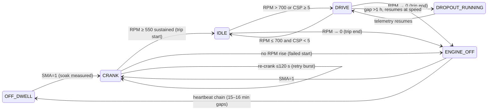

# V3.1 Starter Motor — Operational-State Engine Report

The V3.1 state engine (`state/sm_state_engine.py`) is the durable Tier-3 deliverable: the
first operational-state reconstruction for the SM fleet. It consumes the raw parquets
read-only and writes episodes + weekly rollups for all 34 VINs. It never touches the frozen
caches. Every number is cited from `V3_1_state_params.json`, `V3_1_sv_gates.json`,
`V3_1_gate_summary.json`, or the `V3_1_state_weekly_ALL.parquet` rollup.

---

## 1. Row-level state classifier

Priority-ordered, first match wins (spec §5.1). Thresholds are frozen in
`params/V3_1_state_params.json`.

| Priority | State | Condition | Param |
|---|---|---|---|
| 1 | `CRANK` | SMA == 1 | `cwr_rpm` = 400, `cwr_gap_max_s` = 10 (re-crank flag) |
| 2 | `ENGINE_OFF` | RPM == 0 or RPM null | — |
| 3 | `IDLE` | 0 < RPM ≤ 700 and CSP < 5 | `idle_rpm_max` = 700, `idle_csp_max` = 5.0 |
| 4 | `DRIVE` | RPM > 700 or CSP ≥ 5 | — |
| 5 | `UNKNOWN` | otherwise (sentinel / conflict) | — |

CSP ≥ 65535 → null before classification (`csp_sentinel` = 65535); null CSP treated as
CSP < 5 with a `low_conf` flag. RPM = 0 rows (1.4–8.7 % of the record) make ENGINE_OFF
partially observable in-band, which is what allows soak to be measured at all after the
heartbeat refutation.

---

## 2. Episode + gap semantics

- **Merge**: same-state rows with inter-row gap ≤ `episode_merge_gap_s` = 60 s collapse to
  one episode.
- **Heartbeat band [14, 18] min** (`heartbeat_band_min`): because P0-1 REFUTED the heartbeat
  hypothesis, these chains resolve to `UNKNOWN_GAP`, **not** `OFF_DWELL`. No OFF_DWELL episode
  is emitted anywhere in the fleet.
- **Long gaps > 1 h** (`dropout_min_s` = 3600): P0-3 taxonomy — `DROPOUT_RUNNING` (resume
  RPM > `dropout_resume_rpm` = 500 within `dropout_resume_rows` = 5), `OFF_CONFIRMED`
  (SMA = 1 within `off_confirm_sma_within_s` = 300 s), else `UNKNOWN_GAP`.
- **Soak**: duration of the immediately-preceding `ENGINE_OFF` before each crank; null if the
  preceding episode is DROPOUT/UNKNOWN (this is the source of the short bias).
- **Engine-hours**: Σ dt over IDLE ∪ DRIVE rows, dt capped at `engine_dt_cap_s` = 10 s
  (gap-robust). **Distance**: Σ CSP·dt/3600 over dt ≤ 10 s (gap-capped trapezoid).
- Every episode carries state, t_start, t_end, duration, n_rows, confidence ∈ {high, medium,
  low}, and evidence tags.

### State transition diagram (spec §5.4, verbatim)

The `OFF_DWELL` node is drawn because it is part of the pre-registered design, but P0-1
refuted its trigger — so at runtime the `ENGINE_OFF --> OFF_DWELL` edge is never taken and
soak is read off the `ENGINE_OFF --> CRANK` adjacency instead. `DRIVING_LIGHT/CRUISE/HEAVY`
sub-states from the ALT reference are deliberately not adopted (YAGNI — no consumer needs
them).

---

## 3. Performance note

The first episode builder was O(n·k) in the number of gap-chain merges and blew up to a
measured ~24 minutes on a single high-volume VIN. It was rewritten to a single O(n+k)
forward pass and now completes in ~17 s on a 3.34 M-row VIN. The heartbeat-chain merge is
written to **preserve intervening CRANK rows** rather than swallow them into a gap span — this
is deliberate, because a crank inside a long silence is exactly the failed-crank evidence the
A-family and T1 need. The full-fleet pass over all 34 VINs (~107 M rows) ran in ~35 minutes,
within the spec §12 budget.

---

## 4. Fleet totals (`V3_1_state_weekly_ALL.parquet`, 2,636 VIN-weeks, 34 VINs)

| Quantity | Fleet total |
|---|---|
| Engine-hours (IDLE ∪ DRIVE, dt≤10 s) | **130,842.9** |
| Distance (gap-capped km) | **3,552,966.9** |
| State-CRANK episodes (`n_cranks`) | **20,877** |
| Observed hours | 143,339.5 |
| Idle hours | 24,390.2 |
| Dropout hours | 38,095.8 |
| Unknown-gap hours | 288,936.8 |
| OFF_DWELL hours | **0.0** (heartbeat refuted — by construction) |
| Trips | 425,326 |

**State-CRANK vs frozen event catalog.** The state engine counts 20,877 CRANK episodes
against the frozen crank-event catalog's gap-naive reference of 20,729 — a **+0.7 % (+148)**
difference. This is definitional, not a defect: the state engine merges CRANK rows on a 60 s
gap whereas the event extractor uses a 10 s gap. **The confirmatory gate consumes the frozen
event catalog, not these state-CRANK episodes, so this delta has zero gate impact.** The
large `unknown_gap_hours` (288,936.8) vs `off_hours` (12,976.0) is the quantitative signature
of the heartbeat refutation — the long-park tail is unmeasured rather than mislabeled as
off-dwell.

---

## 5. Validation-gate adjudication (SV-1..SV-5, label-blind)

| Gate | Criterion | Result | Verdict |
|---|---|---|---|
| **SV-1** | ≥ 90 % of cranks preceded within 120 s by OFF/OFF_DWELL/UNKNOWN_GAP or flagged re-crank/CWR | **0.9785** | **PASS** |
| **SV-2** | Per-VIN dwell report; no impossible dwell patterns | report (below) | PASS (report-only) |
| **SV-3** | km/day ∈ [10, 800] and engine-hrs/day ∈ [0.5, 22] for ≥ 90 % of VIN-weeks | **0.936** | **PASS** (B1 retained) |
| **SV-4** | Soak measurable for ≥ 60 % of cranks | **0.7102** | pass = null* |
| **SV-5** | Champion untouched: E0 reconciliation = 0.9357 ± 0.002 | **0.9357** (Δ 0.0000) | **PASS** |

\*SV-4 is recorded `pass: null` because its acceptance was made conditional on P0-1
confirming the heartbeat; since P0-1 refuted it, SV-4 is reported as a soak-measurability
*fact* (0.7102 of cranks have measurable soak) rather than a hard pass/fail, and the soak
catalog family is classified Experimental. 0.7102 comfortably clears the 0.60 design floor,
so soak is usable — just biased short.

**SV-5 / E0 reconciliation (`V3_1_gate_summary.json`).** Computed non-nested LOVO AUROC =
0.9357, expected 0.9357, `pass: true`. The champion is provably untouched by the state-engine
work — as it must be, since the state engine writes only to `state/out/` and never to
`cache/`.

### SV-2 per-VIN dwell summary (all 34 VINs)

`sv1_frac` = cranks with a valid preceding-off/re-crank within 120 s ÷ cranks evaluated;
`soak_frac` = cranks with measurable soak. `sv1_tot` equals the per-VIN state-CRANK count.

| VIN | sv1_ok / sv1_tot | sv1_frac | soak_frac |
|---|---|---|---|
| VIN1_F_SM | 549 / 556 | 0.987 | 0.838 |
| VIN2_F_SM | 135 / 137 | 0.985 | 0.752 |
| VIN3_F_SM | 250 / 263 | 0.951 | 0.684 |
| VIN4_F_SM | 231 / 246 | 0.939 | 0.711 |
| VIN5_F_SM | 77 / 82 | 0.939 | 0.732 |
| VIN6_F_SM | 190 / 194 | 0.979 | 0.706 |
| VIN7_F_SM | 759 / 779 | 0.974 | 0.777 |
| VIN8_F_SM | 1,910 / 1,939 | 0.985 | 0.764 |
| VIN9_F_SM | 663 / 692 | 0.958 | 0.536 |
| VIN10_F_SM | 132 / 143 | **0.923** (lowest) | 0.552 |
| VIN11_F_SM | 189 / 193 | 0.979 | 0.819 |
| VIN12_F_SM | 342 / 350 | 0.977 | 0.789 |
| VIN13_F_SM | 156 / 162 | 0.963 | 0.568 |
| VIN14_F_SM | 701 / 728 | 0.963 | 0.641 |
| VIN1_NF_SM | 282 / 291 | 0.969 | 0.735 |
| VIN2_NF_SM | 280 / 283 | 0.989 | 0.823 |
| VIN3_NF_SM | 239 / 243 | 0.984 | 0.778 |
| VIN4_NF_SM | 1,031 / 1,060 | 0.973 | 0.663 |
| VIN5_NF_SM | 747 / 784 | 0.953 | 0.508 |
| VIN6_NF_SM | 690 / 706 | 0.977 | 0.686 |
| VIN7_NF_SM | 579 / 584 | 0.991 | 0.807 |
| VIN8_NF_SM | 529 / 536 | 0.987 | 0.832 |
| VIN9_NF_SM | 126 / 129 | 0.977 | 0.729 |
| VIN10_NF_SM | 436 / 451 | 0.967 | 0.667 |
| VIN11_NF_SM | 4,116 / 4,161 | 0.989 | 0.823 |
| VIN12_NF_SM | 475 / 482 | 0.985 | 0.782 |
| VIN13_NF_SM | 423 / 431 | 0.981 | 0.661 |
| VIN14_NF_SM | 320 / 328 | 0.976 | 0.817 |
| VIN15_NF_SM | 939 / 953 | 0.985 | 0.844 |
| VIN16_NF_SM | 253 / 258 | 0.981 | 0.566 |
| VIN17_NF_SM | 592 / 599 | 0.988 | 0.838 |
| VIN18_NF_SM | 383 / 388 | 0.987 | 0.804 |
| VIN19_NF_SM | 190 / 203 | 0.936 | **0.404** (lowest) |
| VIN20_NF_SM | 1,514 / 1,543 | 0.981 | 0.511 |

**Data-quality VIN of note.** VIN19_NF_SM is the worst truck on both axes: lowest soak_frac
(0.4039) and near-floor sv1_frac (0.936). VIN10_F_SM holds the lowest sv1_frac (0.9231). Both
still clear the SV-1 90 % criterion, and the fleet aggregate (0.9785) is comfortable.

---

## 6. Promotion recommendation

**PROMOTE the state engine to `STARTER MOTOR/src/`.** All hard SV gates pass (SV-1 0.9785,
SV-3 0.936, SV-5 exact), SV-2 is clean, and SV-4 clears the 0.60 measurability floor at
0.7102. Per spec §5.6 the promotion is a **separate, explicit future commit** — it is not part
of this Task 14 reports commit, which stages only `reports/` and `appendix/`. The engine is
the foundation every future Theme-2/4 idea and the 500-truck program will consume.

*All numbers cited from `V3_1_state_params.json`, `V3_1_sv_gates.json`,
`V3_1_gate_summary.json`, and `V3_1_state_weekly_ALL.parquet`. Fleet: SM, n = 34. Perf/
runtime figures are recorded engineering notes from the state build. SCREEN-GRADE caveat
applies to any label-adjacent reading.*
